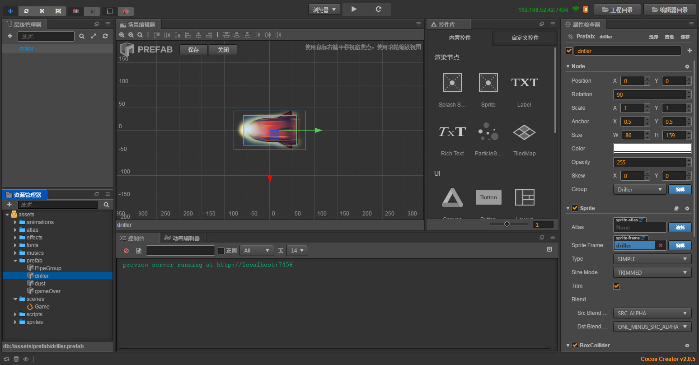
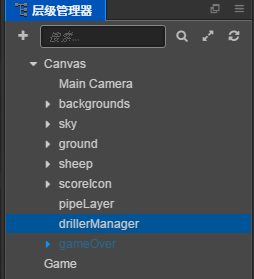

## Duang Sheep项目介绍:

这是一个类似 flappy bird 的小游戏，主人公为一只会飞的绵羊。玩家可以通过点击屏幕操作绵羊进行跳跃避免绵羊撞上障碍物,
越过一个障碍物可得一分，最后看看谁得到的分数最多。<br>

__游戏完成图：__<br>

---
## Git路径:

  >基础项目（资源): https://github.com/cocos-creator/tutorial-duang-sheep/tree/step-1 <br>
  >完整项目(资源or脚本):https://github.com/cocos-creator/tutorial-duang-sheep/tree/master <br>
  
----

### Step5:
上一步完成了绵羊动画，尘土动画，碰撞检测的分组设置等相关内容。这一节我们主要进行游戏整体操控的代码编写，主要功能需求为游戏整体流程的代码编写。<br>
__本章重点__ <br>
- 分数获取并记录分数
- 游戏流程控制，包含碰撞死亡，游戏结束，重新开始等内容
- 创建飞弹 <br>
1. 首先在上一节中我们通过完善 Sheep 脚本（详细内容没有具体讲解，可能需要你到工程内自行研究工程代码）中间我们添加了关于碰撞检测的代码用于检测我们的分组内容确实是生效了。这一节的首要任务就是完善它并将它和 GameManager 的相关逻辑进行结合。
   ```
    // 这里注意我们的碰撞体是作为 sheep 的子节点存在的，因此需要上一节中的 CollisionProxy.js 代理脚本绑定在碰撞子节点上，通过代理的形式执行碰撞函数内容
    onCollisionEnter (other) {
          if (this.state !== State.Dead) {
              let group = cc.game.groupList[other.node.groupIndex];
              switch (group) {
                  case 'Obstacle':
                  case 'Driller':
                      // 碰撞障碍物时的逻辑处理
                      break;
                  case 'NextPipe': 
                      // 通过管道组时的逻辑处理
                      break;
                  case 'Star':
                      // invincible 开启无敌状态
                      break;
                  default: 
                      break;
              }
          }
      },
   ```
2. 了解到 Sheep 中碰撞功能需要的反馈逻辑之后我们将这部分逻辑安置到 GameManager 中，这里我们来分析一下这样安排的原因吧。
   - 首先是分析代码逻辑涉及部分，以碰撞障碍物时逻辑为例，当前的案例中我们需要考虑在碰撞时:
   - 游戏的状态直接变为 game over。
   - 绵羊状态变为 dead 状态。
  那么需求被分为了两个部分，代码设计中一个相当重要的原则，单一责任原则，涉及到某个对象的的逻辑功能，就应该讲对应功能放置到对应的 class 下，因此负责游戏整体逻辑的功能 gameOver 被包装划分到了 GameManager 下，而涉及到绵羊本体逻辑部分就留在 Sheep 脚本中。
  通常我更建议在 switch 判断下通过 function 将你需要实现的逻辑进行封装，比如这样
  ```
  switch (type):
    case 'enemy':
        this.getDamage(); // or this.go2Dead();
        this.gameManager.gameOver();
    case: ······
  ``` 
3. 在 GameManager 中，我们绑定游戏所需要的音效并由 GameMananger 进行操控，但是因为音频功能和其他部分的功能牵扯最少，所以这里不做详细的讲解，若是对相关组件和管理感兴趣建议参考官方的 [音效 API](https://docs.cocos.com/creator/api/zh/classes/audioEngine.html) 和 [音效手册](https://docs.cocos.com/creator/manual/zh/audio/audio.html) 文档。 <br>
   
之后我们只需要完成 gameOver 和 gainScore 相关流程内容就可以尝试着将 GameManager 模块引用到 Sheep 脚本中。 <br>
在 Creator 中有两种引用 __cc.Class__ 方式，第一种是通过 Creator 的 properties 设置获取 Component（若你对 cc.Class 还不够熟悉的话就到官方 [进阶手册](https://docs.cocos.com/creator/manual/zh/scripting/reference/class.html#type) 中查看相关信息）；第二种是通过 require 获取需要的 Class。第二种方式获取的对象和你在面向对象编程过程中 include 或者 import 获取一个 class 相似。
```
    // 第二种方式，这种方式一般定义在脚本开头，当然，也可以更加的灵活的使用在代码中。
    const Sheep = require('./Sheep');
```
这里在关于 gameOver 中的代码进行一下解析。
```
    gameOver () {
        // stop the running
        this.state = State.Over;
        // 停止物体生成
        this.pipeManager.getComponent('PipeGroupManager').reset();
        this.drillerManager.getComponent('DrillerManager').reset();
        // 停止音乐
        cc.audioEngine.stopMusic();
        cc.audioEngine.stopEffect(this.dieAudio);
        cc.audioEngine.stopEffect(this.gameOverAudio);
        // 相关物体的显示
        this.gameOverMenu.active = true;
        this.gameOverMenu.getComponent('GameOverMenu').score.string = this.score;
    }
```
当游戏结束时当前场景内的所有物体都应该停止运作，因此我们获取所有生成器组件进行场景物体生成管理，当然我们也有 __cc.director.pause__ 这种方便的操作，通常也建议使用这个 API 来停止场景中物体的运作。这个 API 的实际效果如下：
  - 不会影响渲染逻辑和 UI 响应，这意味着 active = true 可以控制物体显示，同时 Button 等 UI 组件仍然会相应到你的点击。
  - pause 控制的是整个游戏进行暂停，一定需要配合 resume 进行使用，不然即使重新进入场景也是暂停状态。
  - pause 会对 schedule 产生影响。
还有很多特性，你可以在实际使用中自己进行测试，这将是你独一无二的使用经验，我们也欢迎你的 __反馈分享！__
任何事物都有两面性，这里我们不使用 pause 一方面是为了让游戏设计流程以及代码框架更加的详细（并不强求，如果你希望你的代码更加的简洁，不妨自行调整使用 pause），另一方面是建议各位多动手写自己的代码，在不确定因素过多的情况下，自己书写的代码具有更强的可控性。
4. 详细的代码内容需要你到工程中自己查看，在完成了 GameManager 的功能添加之后，接下来需要增加重新开始游戏功能，你可以将这个功能写在 GameManager 中，当然我们还是重新创建了一个新的 GameOverMenu.js 单独控制面板 （不强求新建脚本，保持功能一致就可以）。<br>
  功能完成之后将其绑定在我们第三节中创建的 gameOver 面板中的按钮上（若你对 Creator __按钮__ 相关功能还不够熟悉，建议查看官方 [Button 组件手册](https://docs.cocos.com/creator/manual/zh/components/button.html)文档）。<br>
5. 完成了脚本和流程的构建，我们在多做一点额外的简单工作，创建一个新的障碍物——飞弹。<br>
   按照之前创建 PipeLayer 和 PipeGroup 相似的操作，创建好我们的 Driller Prefab（详细参数设置见工程内）。
    <br>
6. 在之后我们在场景中创建一个飞弹生成管理器，参数设置和 PipeLayer 相同即可。<br>
    <br>
7. 最后创建 DrillerManager.js 和 Driller.js 内容。这里针对 Driller.js 内容进行一下讲解。
   ```
       update (dt) {
        if (!this.sheep) {
            return;
        }
        var targetPos = this.sheep.position;
        var selfPos = this.node.position;
        // unit direction
        var expectedDir = targetPos.sub(selfPos).normalizeSelf();
        var selfDir = getDir(this.node);
        var isLeft = selfDir.cross(expectedDir) > 0;
        if (isLeft) {
            this.node.rotation -= this.angleVelocity * dt;
        }
        else {
            this.node.rotation += this.angleVelocity * dt;
        }

        // move forward
        var speed = getDir(this.node).mul(this.velocity * dt);
        this.node.position = selfPos.add(speed);
        // destroy this node
        if (this.node.x < -700) {
            this.node.removeFromParent();
            this.node.active = false;
            this.node.destroy();
        }
    }
   ```
   通过 getDir 获取当前朝向，根据已获得的当前位置以及 sheep 的位置，计算向量，获取的向量通过 cross （叉积）获取旋转方向。 <br>
   通过当前物体方向乘上速度比例获得向前移动速度。<br>
   最后当物体超出我们视窗界面之后我们销毁物体。<br>
8. 最后还是着重提醒一下，一定要按照 __循序渐进__ 的规则，逐步测试以及查看场景效果是否正确，千万 __不要着急__ 一口气完成所有的设定导致 bug 层出不穷。

- Step4: https://github.com/cocos-creator/tutorial-duang-sheep/tree/step-4 
- Step6: https://github.com/cocos-creator/tutorial-duang-sheep/tree/step-6